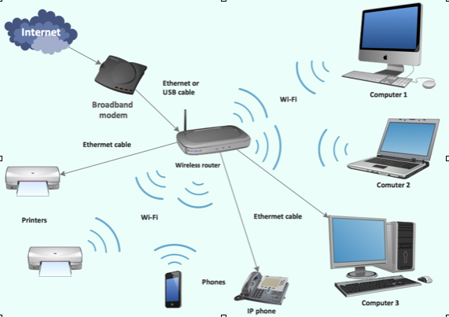
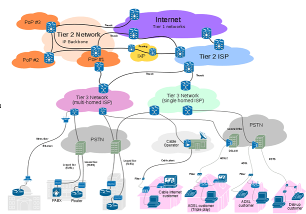

## Computer networks:
A computer network is a collection of computers that are connected to each other.
- A _network device_ facilitates the connection.
  - examples: ethernet switch, wireless access point, edge router…
- In a local network, all the computers are connected to the same network device.
- Here is an example of a local network diagram:

## Common network connection types.
Since Computers work in binary only, a code made up of only 1s and 0s, in order for two computers to communicate, we must be able to send 1s and 0s between them. There are many ways to to do this, these are the most common approaches:
- Radio Waves (RF)
  - The difference in amplitude (height) of the wave is what is used to represent 1s and 0s.
  - Very good for connecting computers where direct cables are not possible.
  - Not as fast as direct connections.
  - Examples: WiFi, bluetooth, satellite, cellular networks.
- Electricity
  - Much faster than wireless connections.
  - Requires a cable or series of cables that physically connect the devices.
  - Because this uses electric signals, there is a limit to how long the cables can be before the signal degrades, and there is a limit on how much data can be transmitted before it creates interference.
  - Transmitting electric signals over (usually) copper wires. Differences in voltage (power) represent the 1s and 0s (usually high voltage = 1, low voltage = 0).
  - Examples: Ethernet, Cable, DSL, Telephone lines
- Light
  - The fastest form of network connection.
  - Light can be transmitted over longer distances than electricity, and it does not create interference, so much more data can be transmitted at the same time.
  - Requires special glass cables that are fragile and expensive.
  - Sending pules of light over glass-like cables. The presence or absence of light translates to 1s and 0s.
  - Example: Fiber optic cables

## The Internet
- The internet is a group of [**Inter**connected **net**works](https://www.vox.com/a/internet-maps).
- The connection of top tier internet service providers creates the _backbone_ of the internet.
- Almost all of these connections use fiber optic cables.
- This is an example of a group of network connected.

* Many countries are connected via long underwater fiber optic cables. You can see a map of all these cables here: https://www.submarinecablemap.com/

## Internet Addresses
Every device connected to the internet has an I.P. (Internet Protocol) address.
- There are 2 main versions of I.P. addresses IPv4 and IPv6
  - IPv4 is the older and more common version.
    - IPv4 uses 4 byte addresses of the form:
      - `[0-255].[0-255].[0-255].[0-255]`
      - Example: `149.89.150.100`
    - There is a limit to the possible amount of IP addresses of ~4.2 billion. This may seem like a lot but it is much less than is needed. There are over 8 billion people in the world, and while they all don't have a device connected to the internet, it would be a good thing if we made sure there was enough space for everyone.
  - IPv6 is a newer standard, that allows for many more addresses.
    - IPv6 uses 16 byte addresses of the form:
      - `[0-ffff]:[0-ffff]:[0-ffff]:[0-ffff]:[0-ffff]:[0-ffff]:[0-ffff]:[0-ffff]`
      - `ffff` is a base 16 number that equals 65,535, we use base 16 because otherwise the addresses would be very long.
      - Example: `0:0:0:0:0:ffff:9559:9664`
      - These is a direct conversation of all IPv4 addresses to IPv6, the example above is the same address as the IPv4 example. This makes it easier to use both protocols.
      - There are 2^128 possible IPv6 addresses.
- IP addresses are only needed when connected to the internet.
- For the most part, individual people don't own IP addresses, organizations and big companies own blocks of IP addresses, and give them to their users as needed.

## Domain Names
Humans are less likely to remember IP addresses because they are all numbers.Domain names are “words” meant to easily identify organizations on the internet without having to know IP addresses. There is a hierarchy of Domain Names:
- .com, .sl, .edu, .gov, .org are all examples of __top level domains__.
  - No single person or company can own a top level domain. They are regulated by the Internet Corporation for Assigned Names and Numbers (ICANN)
- google.com, stuy.edu, stuycs.org are examples of __second level domains__.
  - Anyone can register a second level domain, from companies, to government institutions to individuals. As long as the name is available you can pay a fee to have your own second level domain.
- mail.google.com, homer.stuy.edu, www.stuycs.org are further __subdomains__.
  - If you control a second level domain, you can make any subdomains you want. There are some rules about what you can put in a domain and subdomain name. For example, you cannot use spaces or `?` in them.
- DNS (Domain Name System) is a service that translates between domain names and IP addresses. This is needed because the actual computer you want to connect to uses an IP addresses to identify itself, not a domain name.
  - Whenever you go to a website via domain name, the first thing that happens is your computer sends a request to translate that domain name into an IP address.

## Servers
- A server is a computer configured to respond to requests coming from other computers (either over a local network or the internet).
- A server provides data, computing power, or both.
- Examples of server types:
  - Web server (data): stores & transmits websites.
  - SSH server (computing power): allows remote connection to use a computer.
  - Database server (data): stores & provides access to information stored in a database.
  - DNS server (data): stores & provides IP addresses given domain names.
- Often, servers provide multiple services.
- A client is a computer that connects to and uses a server.

## Protocols
- A protocol is a set of rules for transmitting data for a specific purpose.
- Often, different kinds of network-based services will use different protocols.
- Examples of protocols:
  - HTTP - Hyper Text Trasmission Protocol: used to transmit _unencrypted_ web pages.
  - HTTP - Secrure HTTP: used to transmit _encrypted_ web pages.
  - NFS - Network File System: used to transmit files to/from a file server.
  - ICMP - Ping: used to check if there is a netowrk path to a computer.

## Websites
A web page is a file on (most likely) another computer formatted to be viewed through a web browser. A website is a collection of 1 or more connected web pages.
A webpage can contain the following kinds of files:
- HTML: Content and general layout of a web page.
- CSS: Styling and advanced layout.
- Javascript: Code that is run BY YOUR BROWSER.
- Various media files (image, video, audio...)
When you visit a website, all the associated files are transmitted and downloaded onto your computer. Often, a website will ask your web browser to store a small amount of information on your computer. This is called a cookie.
